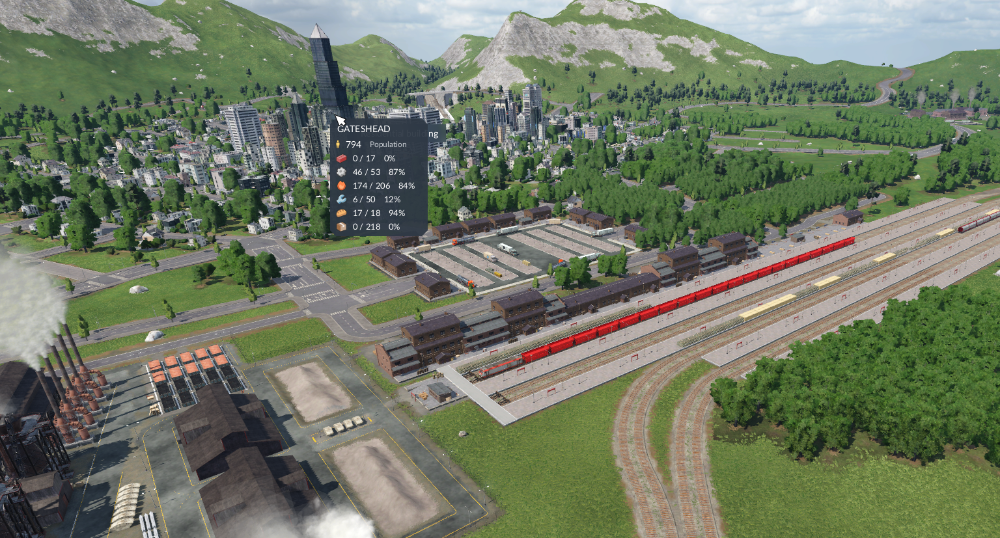
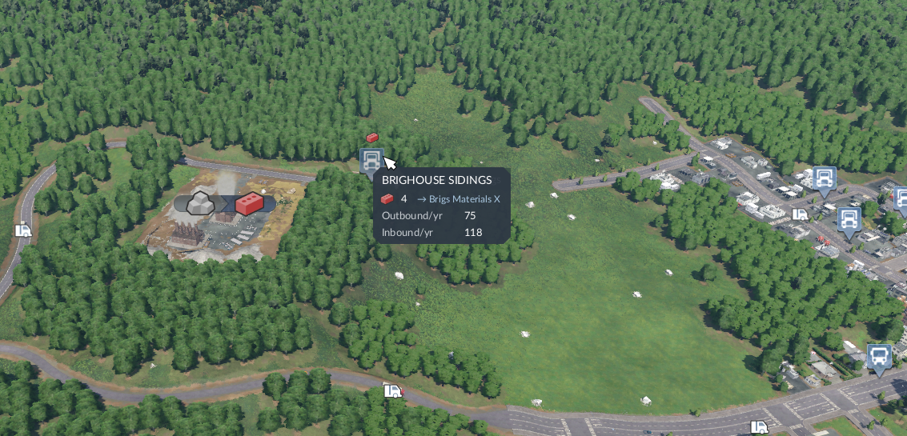
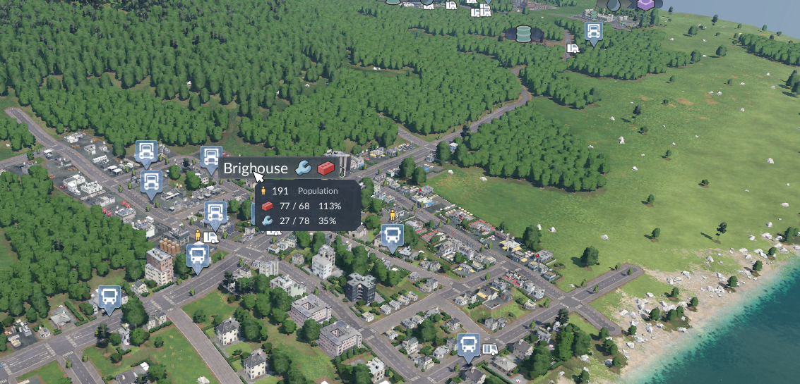
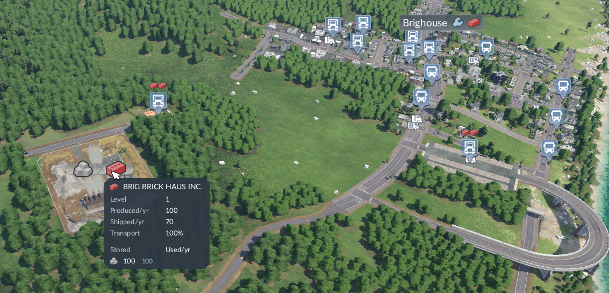
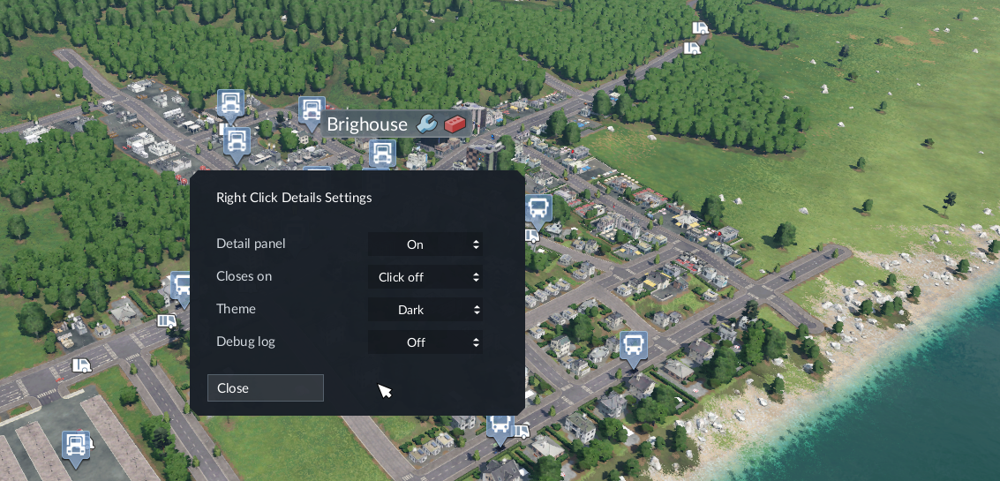

# Right Click Details

Right-click a town, industry, station or depot in Transport Fever 2 for a
compact readout, without opening the full window.

**Version 1.2** — see `changelog.txt`.

Settings live behind the mouse button on the right of the HUD bar: panel on/off,
how the panel closes, theme, and debug logging. They persist through the game
script's `save()`/`load()`, so they are stored **with the savegame** — change a
setting and save, or wait for an autosave, or it reverts.

`severityAdd` and `severityRemove` are both `NONE`, so the mod can be added to
and removed from an existing save freely; the settings table is additive and is
simply orphaned if the mod is removed.

## Media



Gateshead: population and every commodity the town wants, with supply and fill
percentage. This shot supplies both preview images.



Station: waiting cargo with the line each item is queued for, plus outbound and
inbound throughput.



Town: population, and the commodities it wants with supply and fill percentage.



Industry: output commodity beside the name, level, produced and shipped per
year, transport rating, and stored versus consumed inputs below a rule. Stock
running short relative to consumption is highlighted.



Settings, opened from the mouse button on the right of the HUD bar.

### Where images actually go

Three separate slots, easy to confuse:

| File | Used for | Format |
|---|---|---|
| `image_00.tga` | in-game mod list thumbnail | 320×180, 24bpp uncompressed TGA |
| `workshop_preview.jpg` | Steam Workshop preview | JPEG |
| `modio_preview.jpg` | mod.io preview (not used here) | JPEG |

The publish dialog reports `[not found] workshop_preview.jpg` if that file is
missing — `image_00.tga` does **not** cover it. All three names are literals in
the binary, alongside separate "JPEG couldn't be read" / "TGA could not be read"
errors.

The engine loads exactly one in-game image: there is no `image_01` and no
numbered pattern anywhere. `media/` is documentation only — for this README and
for pasting into a Workshop description by hand, where Steam does allow several.

## Selection

The panel cannot hit-test the label you clicked. `TownItem` and the station and
depot icons are engine-rendered, absent from the `api.gui` tree; there is no
world→screen projection exposed, and `game.gui.getContentRect("townhudicon")`
returns nil. All three routes confirmed dead by probe.

So selection ranks everything near the terrain point under the cursor and lets
you **right-click again to cycle** through it. A town is promoted to the front
when the click lands within `TOWN_LABEL_RADIUS` of its centre, since that is
exactly where its label is drawn.

## Layout

```text
mod.lua                                     metadata, params, runFn
strings.lua                                 en localisation
res/config/game_script/rlv_cityoverlay.lua  the panels
res/config/style_sheet/rlv_cityoverlay.lua  styling (CONFIG at top)
res/scripts/rlv_cityoverlay_config.lua      values shared with mod.lua
res/textures/ui/rlvcityoverlay/             generated bevel 9-slice
tools/make_bevel.py                         regenerates that bevel
tools/make_mouse_icon.py                    regenerates the toolbar icon
changelog.txt                               release notes
image_00.tga                                in-game thumbnail, 320x180 TGA
workshop_preview.jpg                        Steam Workshop preview, 640x360
media/                                      README / description screenshots
.luarc.json                                 VS Code Lua extension config
```

Internal identifiers still carry the old `rlv_cityoverlay` prefix from before
the mod was renamed. They are folder-independent and not player-visible.

## Engine notes worth keeping

Findings that cost real time to establish:

- **`api.engine.system.*` returns userdata, not tables.** `game.interface.*`
  returns Lua tables. Guarding with `type(x) == "table"` silently discards every
  successful `api.engine` result — this caused line names and stock counts to
  read `--` for several iterations while the calls were working fine. Use
  `toTable()`.
- **Stylesheets evaluate in an isolated Lua state.** They cannot `require` this
  mod's own scripts (only the base game's `res/scripts` is on the path), and
  they cannot see values `runFn` publishes on `game`. Tune visuals in the
  `CONFIG` table at the top of the stylesheet.
- **`_()` behaves differently per context.** In a game script `_currentModIdTr`
  is nil, so symbolic ids never resolve — use the English text as the key.
  Symbolic ids only work in `mod.lua`.
- **The engine runs Lua 5.2.** No `\u{XXXX}` escapes; use byte escapes.
- **No corner-radius style property exists.** Bevelled corners come from a
  9-slice image; see `tools/make_bevel.py`.
- **`-1` is the fill sentinel**, in both `gravity` and `size`. On an `ImageView`
  it stretches the icon. Icons are sized with `scaling` only — the source
  textures are not square (commodities 24x19, passengers 16x32), so any fixed
  box distorts them.
- **Lengths** are plain pixels here. The engine also accepts `"NNvw"` / `"NNvh"`
  strings; the parser rejects anything else — no `%`, `px` or `em`.
- **The mod folder's `_N` suffix is the major version.** Do not declare
  `majorVersion` in `mod.lua`; no shipped mod does.
- **Engine containers nest.** Stored stock lives behind
  `stockListSystem.getCargoType2stockList2sourceAndCount()`, and its innermost
  `sourceAndCount` value is *another* container (its metatable exposes
  `add/at/size/find/get/insert/next/pairs`), not a struct with a `count` field.
  Read it with `ipairs` — Lua 5.2 honours `__ipairs`, which these types define —
  or with the container's own `size()`/`at()`, then sum the values.

## Iterating

Lives in `staging_area/`, so it loads without packaging. Stylesheets are read
**once per process**, so visual changes need a full restart — reloading a save
is not enough. Game-script changes come back on a save reload.

`print()` output lands in:

```text
~/.steam/steam/userdata/24778163/1066780/local/crash_dump/stdout.txt
```

## Known gaps

- The panel's percentage is `supply / limit`, not the growth-contribution `%`
  from the town window — that is computed in C++ and not exposed.
- **Rate figures will not match the industry window, by design.** Ours are
  trailing-twelve-month totals from the entity's `_lastYear` accumulators;
  the window shows a live rate over capacity (`30/100`) computed internally.
  `getIndustryProduction` / `ProductionLimit` / `Shipping` all fail their
  pcall, and capacity is `baseCapacity * (level+1)` with `baseCapacity` in each
  industry's config rather than on the entity — so neither half of the window's
  figure is reachable. Labels carry `/yr` so the difference is stated rather
  than looking like a bug. `Stored` is exempt: it is a live level and should
  match.
- Industry capacity (the `/400` the window shows) cannot be read: it is
  `baseCapacity * (level+1)` per `industryutil.lua:146`, and `baseCapacity`
  lives in each industry's own config rather than on the entity.
